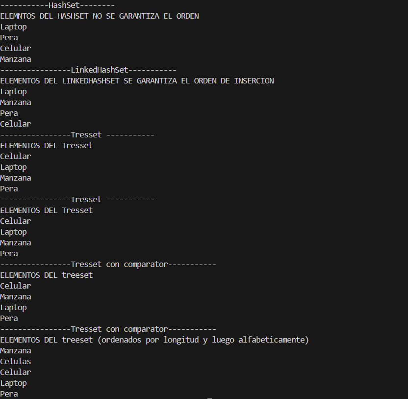
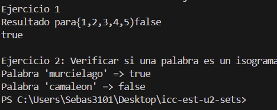

+# Practica Sets

## 📌 Información General

- *Título*: Práctica Sets
- *Asignatura*: Estructura de Datos
- *Carrera*: Computación
- *Estudiante*: Sebastian Rafael Ceron Miranda
- *Fecha*: 05/06/2025
- *Profesor*: Ing. Pablo Torres

---

# Ejercicios con Sets en Java

Este proyecto contiene la implementación de algoritmos para trabajar con colecciones Set en Java, específicamente HashSet, LinkedHashSet y TreeSet. Los ejercicios están diseñados para practicar el uso de estas estructuras de datos sin utilizar listas u otras colecciones.

---

## 🧠 Ejercicio 01: Ordenar un Stack en orden ascendente (con HashSet y TreeSet)

En este ejercicio, se implementa un algoritmo para ordenar elementos en una estructura de tipo Set y manipular la forma en que los elementos se almacenan.

#### *Clases utilizadas*:
- 📂 Estructura principal:
Clase App: Ejecuta varios métodos que construyen y muestran los diferentes tipos de Set.

Clase Sets: Contiene la lógica para construir cada conjunto.

Clase ContactoController:

runTreeeContacto(): Usa un TreeSet con un comparador personalizado (ContactoComparator) que ordena por apellido y luego por nombre.

runTreeeContactoInverso(): Usa un TreeSet con otro comparador (ContactoComparatorConNumero) que también considera el número de contacto como criterio de orden.

🔍 Características clave:
HashSet: No garantiza orden.

LinkedHashSet: Mantiene el orden de inserción.

TreeSet: Ordena automáticamente según el criterio natural o un Comparator definido.

Comparadores personalizados para ordenar objetos Contacto por distintos criterios (apellido, nombre, número).

---

## 🖼 Captura de pantalla

Foto 2

